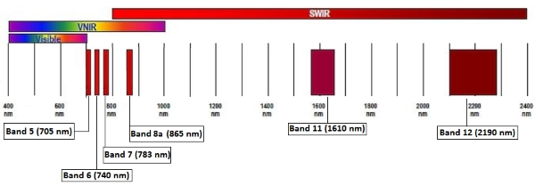

.. _rasterio:

Knihovna Rasterio
=================

Knihovna `Rasterio <https://github.com/mapbox/rasterio>`_ je opět dílo
zejména `Seana Gilliese <http://sgillies.net/>`_ (podobně jako
:doc:`Fiona <../../vektorova_data/fiona/index>` či Shapely), tentokrát
v rámci jeho působení ve firmě `MapBox <http://mapbox.com>`_. Rasterio
je knihovna pro práci s rastrovými geografickými datovými sadami. Na
pozadí Rasterio používá spolehlivou knihovnu `GDAL
<http://gdal.org>`__.

Rasterio pracuje s objekty knihovny `NumPy <http://www.numpy.org/>`_
(podobně jako dříve zmíněná :doc:`Fiona
<../../vektorova_data/fiona/index>` pracuje s objekty JSON). Autor
tvrdí, že Rasterio se vyslovuje *[raw-STEER-ee-oh]* a měla by práci s
rastrovými daty udělat více zábavnou a produktivnější.

Vstupní data
------------

Pro vstupní data použijeme dataset stažený ze stránky `Earth Explorer
<https://apps.sentinel-hub.com/eo-browser/>`_, která zpřístupňuje data
ze satelitů programu `Sentinel
<http://copernicus.eu/main/sentinels>`_.

* data/B01-2018-05-06.tiff
* data/B02-2018-05-06.tiff
* data/B03-2018-05-06.tiff
* data/B04-2018-05-06.tiff
* data/B05-2018-05-06.tiff
* data/B06-2018-05-06.tiff
* data/B07-2018-05-06.tiff
* data/B08-2018-05-06.tiff
* data/B09-2018-05-06.tiff
* data/B10-2018-05-06.tiff
* data/B11-2018-05-06.tiff
* data/B12-2018-05-06.tiff
* data/B8A-2018-05-06.tiff

Otevření datasetu
-----------------

Rastrový soubor (skupina souborů) - dataset - se otevírá pomocí funce
``open()`` z modulu `rasterio` obdobně jako v případě knihovny Fiona
vektorové soubory.

.. literalinclude:: ../../_static/skripty/rasterio-open.py
   :language: python
   :linenos:

.. task:: Zjistěte následující atributy rastrového datasetu:

        * počet kanálů
        * definici souřadnicového systému
        * velikost rastrového souboru (počet pixelů)
        * prostorové rozlišení

Můžeme si ihned nechat vypsat metadata o otevřeném datasetu.

Kanály družice Sentinel 2
-------------------------

Data z družice Sentinel 2 obsahují světelné spektrum v různých pásmech
(`B01-BBA`), jak ale
zjistit, která pásma jsou která? To je popsáno v dokumentaci na stránce
projektu: https://earth.esa.int/web/sentinel/user-guides/sentinel-2-msi/resolutions/spatial

.. figure:: ../../images/sentinel2-1.png

.. figure:: ../../images/sentinel2-3.png
        
        Rozlišení kanálů družice Sentinel-2, https://earth.esa.int/web/sentinel/user-guides/sentinel-2-msi/resolutions/spatial

Zobrazení dat
-------------

Nejsnadnější cesta, jak zobrazit data, vede přes desktopovou prohlížečku
`QGIS <http://qgis.org>`_. Viz :skoleni:`školení pro QGIS začátečníky
<qgis-zacatecnik/rastrova_data/rastr_import.html>`.

.. figure:: ../../images/green.png
   :class: middle
           
      Zobrazení zeleného kanálu v programu QGIS.

.. task:: Dokážete najít rozdíl mezi Českou republikou a Rakouskem?

   Podívejte se na satelitní snímek a zjistěte, zda jste schopni
   pouhým okem rozlišit Českou republiku a Rakousko.

.. note:: Zobrazení rastrových dat v okně Jupyter notebooku

        ::

                import PIL.Image

                # we have to convert the data from 16bit to 8bit, so that PIL can work with it
                bit8_green = (green.read()[0]/256).astype('uint8')
                PIL.Image.fromarray(bit8_green, "L")

Příklady
--------

.. toctree::
    ndvi 
    windows
    reclass
    vectorisation
    plugins
