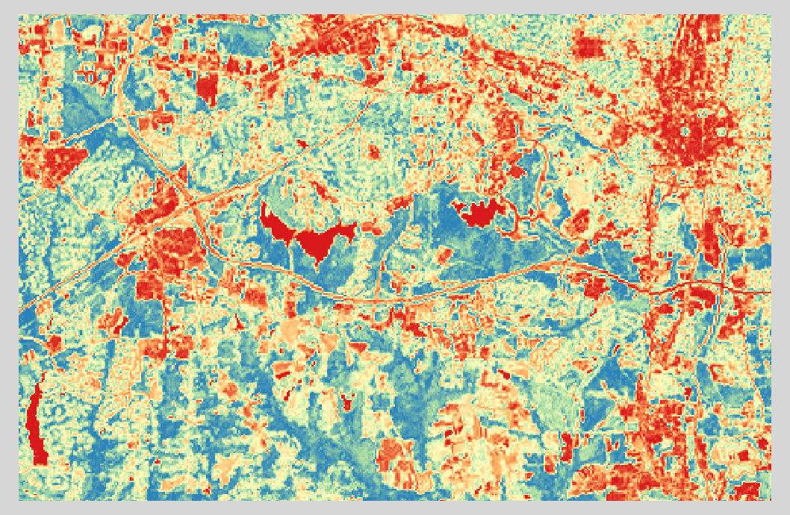

Knihovna Rasterio
=================

Knihovna `Rasterio <https://github.com/mapbox/rasterio>`_ je opět dílo
zejména `Seana Gilliese <http://sgillies.net/>`_ (podobně jako
:doc:`Fiona <../../vektorova_data/fiona/index>` či Shapely), tentokrát v rámci
jeho působení ve firmě `MapBox <http://mapbox.com>`_. Rasterio je
knihovna pro práci s rastrovými geografickými datovými sadami. Na
pozadí Rasterio používá spolehlivou knihovnu `GDAL <http://gdal.org>`__.

Rasterio pracuje s objekty knihovny `NumPy <http://www.numpy.org/>`_
(podobně jako dříve zmíněná :doc:`Fiona
<../../vektorova_data/fiona/index>` pracuje s objekty JSON). Autor
tvrdí, že Rasterio se vyslovuje *[raw-STEER-ee-oh]* a měla by práci s
rastrovými daty udělat více zábavnou a produktivnější.

V následujícím příkladu otevřeneme rastrový soubor ve formátu
:wikipedia-en:`GeoTIFF` a podíváme se na některá metadata:

.. literalinclude:: ../../_static/skripty/rasterio-example.py
   :language: python
   :lines: 1-3
              
.. code-block:: python

    BoundingBox(left=596670.0, bottom=185000.0, right=678330.0, top=258500.0)

.. literalinclude:: ../../_static/skripty/rasterio-example.py
   :language: python
   :lines: 5

.. code-block:: python
                
   {u'lon_0': -79, u'datum': u'NAD83', u'y_0': 0, u'no_defs': True,
   u'proj': u'lcc', u'x_0': 609601.22,
   u'units': u'm', u'lat_2': 34.33333333333334, u'lat_1': 36.16666666666666,
   u'lat_0': 33.75}

.. literalinclude:: ../../_static/skripty/rasterio-example.py
   :language: python
   :lines: 7

.. code-block:: python
                
    {u'AREA_OR_POINT': u'Area'}

.. literalinclude:: ../../_static/skripty/rasterio-example.py
   :language: python
   :lines: 9

.. code-block:: python
                
    (1287, 831)

.. literalinclude:: ../../_static/skripty/rasterio-example.py
   :language: python
   :lines: 11
    
.. code-block:: python
                
    (10.0, 10.0)

.. figure:: ../images/rgb.png

   RGB kompozice.

Načtení barevných kanálů:

.. literalinclude:: ../../_static/skripty/rasterio-example.py
   :language: python
   :lines: 13-14

.. code-block:: python

    3

Vidíme, že v rastru jsou obsaženy tři barevné kanály. Vytvoříme nyní nový
soubor, obsahující pokus o index NDVI.

.. note:: :wikipedia-en:`Normalizovaný vegetační index
    <Normalized_Difference_Vegetation_Index>` je poměr mezi viditelným
    červeným kanálem a blízkým infračerveným kanálem satelitních dat.

    .. math::
        
         NDVI = (NIR - VIS) / (NIR  + VIS)

Neprve vytvoříme novou matici pro výsledné hodnoty, následně do tohoto
pole uložíme výsledek výpočtu pro každý pixel. Pracujeme v prostředí
NumPy, které práci s poli významně usnadňuje.

.. literalinclude:: ../../_static/skripty/rasterio-example.py
   :language: python
   :lines: 16-18

.. code-block:: python

    -0.94444442, 0.97435898

Výsledek uložíme do nově vytvořeného souboru. Data budou zkomprimována
pomocí LWZ komprese a uložena v číselném formátu `float64` (rastrový
soubor obsahuje čísla s plovoucí desetinnou čárkou a záporné
hodnoty). Výsledný soubor ve formátu GeoTIFF bude mít pouze jeden
kanál.

.. literalinclude:: ../../_static/skripty/rasterio-example.py
   :language: python
   :lines: 20-24

    
    Výsledný soubor s NDVI indexem.
