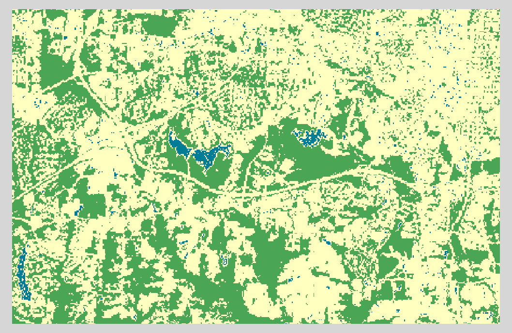

.. _rasterio-reklasifikace:
.. _reklasifikace:

==================
Interpretrace NDVI
==================

Jedním z možných postupů je reklasifikace vstupních dat do uživatelem
definovaných tříd.

Reklasifikací se přiřadí nové hodnoty vstupním datům, v našem příkadě
bychom rádi identifikovali vodní tělesa, ostatní objekty nás
nezajímají.

Jak jsme si řekli výše, vodní tělesa by měly mít hodnotu NDVI okolo 0, shodněme
se, na hodnotách `<-0.1; 0.1>`. Výsledný rastrový soubor bude obsahovat 2
hodnoty: 1 a `NULL` (tedy žádná data), která bude reprezentována číslem -9999.

.. literalinclude:: ../../_static/skripty/ndvi_reclass.py
   :language: python

.. figure:: ../images/water.png
    
    Výsledný soubor s hodnotami 1 - voda, -9999 - NODATA.

.. note:: Takováto identifikace vodních ploch je samozřejmě velmi
   nepřesná. V DPZ se používají většinou jiné techniky.

.. task:: 

   Pokuste se podobným způsobem do snímku přidat kategorii s hustou
   vegetací a další kategorie, podle klíče:

        1. voda
        2. hustá vegetace
        3. zástavba
        4. ...

Rozdělíme NDVI do tříd podle jejich hodnoty. NDVI nabývá hodnot od -1
do 1, rozdělíme je na 3 skupiny "od oka":

.. cssclass:: border

+---+------------------+---------------+
| 1 | Stromy           | 1 - 0.4       |
+---+------------------+---------------+
| 2 | Tráva            | 0.4 - 0.2     |
+---+------------------+---------------+
| 3 | Suchá půda, sníh | 0.1 - -0.1    |
+---+------------------+---------------+
| 4 | Voda             | -0.1 - -1     |
+---+------------------+---------------+

.. literalinclude:: ../../_static/skripty/rasterio-reclass.py
   :language: python

Výsledný soubor obsahuje pouze 4 hodnoty reprezentující jednotlivé třídy.

    
    Výsledný soubor se třemi třídami.
