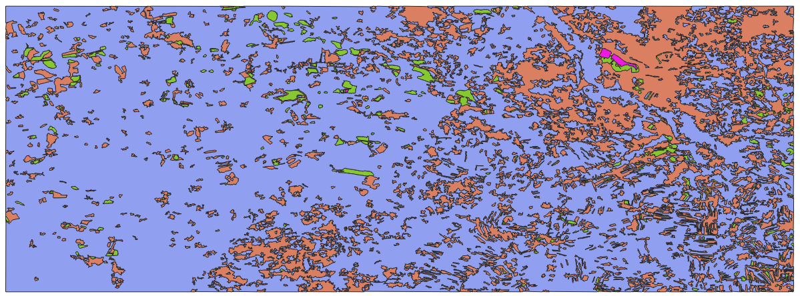

.. _rasterio-vectorise:

Vektorizace rastrových dat
--------------------------

Převod rastrových na vektorová data - ohraničení pixelů o stejné hodnotě.

Jelikož používáme `Numpy <http://www.numpy.org/>`_ struktury, můžeme
pro tuto konverzi využít více nástrojů.

Vektorizace pomocí rasterio
^^^^^^^^^^^^^^^^^^^^^^^^^^^

Modul `rasterio.features
<https://rasterio.readthedocs.io/en/latest/api/rasterio.features.html>`__
obsahuje nástroje pro vektorizaci rastrových dat. K dispozici je
funkce `shapes
<https://rasterio.readthedocs.io/en/latest/api/rasterio.features.html#rasterio.features.shapes>`__,
která převede sousedící pixely o stejné hodnotě do vektorového formát
GeoJSON.

Hodit se může i např. funkce `sieve
<https://rasterio.readthedocs.io/en/latest/api/rasterio.features.html#rasterio.features.sieve>`__,
kterou můžeme použít na odfiltrování příliš malých ploch.

Jedním z podstatným vstupů je také transformační matice, která převede
vektorová data ze souřadnic obrázku (pixely) na souřadnice
geografické.

.. literalinclude:: ../../_static/skripty/rasterio-vectorize.py
   :language: python

    
    Výsledný vektorový soubor

Vektorizace pomocí potrace
^^^^^^^^^^^^^^^^^^^^^^^^^^

Další možností je vektorizace pomocí knihovny `pypotrace
<https://pythonhosted.org/pypotrace/>`_.  `Potrace
<http://potrace.sourceforge.net/>`_ se používá v množství dalších
programů (např. Inkscape). Nabízí další možnosti vektorizace, ale
musíte vyřešit převod geografických souřadnic.

.. todo:: Příklad s Potrace. Jedním z problémů pypotrace je, že
        funguje pouze v Python 2.x.

Rasterizace vektorových dat
---------------------------

.. todo:: Modul `rasterio.features
          <https://rasterio.readthedocs.io/en/latest/api/rasterio.features.html>`_
