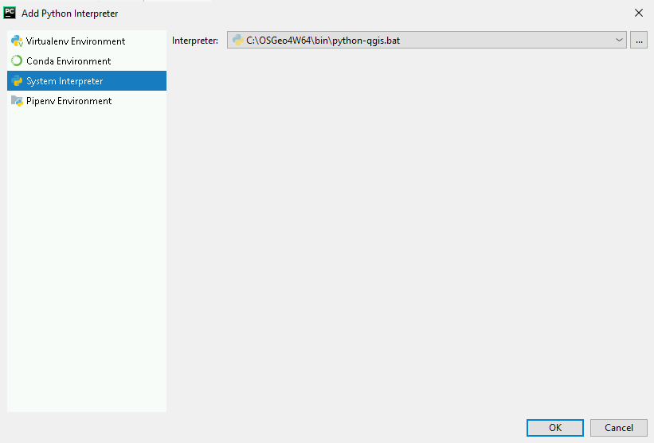
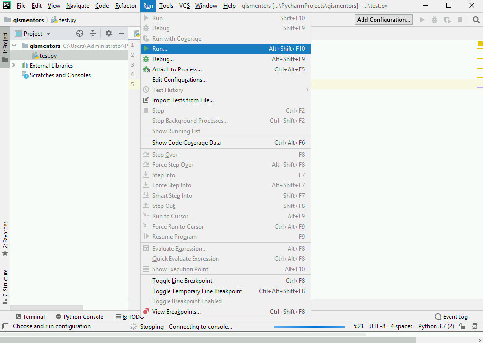
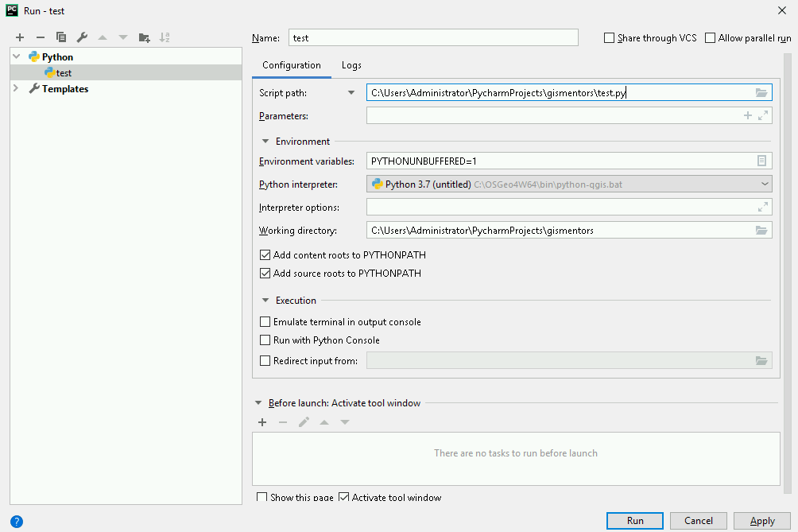

Editor PyCharm
==============

Pro uživatele MS Windows (nejen) se jako vhodný jeví nástroj `PyCharm
<https://www.jetbrains.com/pycharm/>`__.  V komunitní verzi je k
dispozici zdarma. Jeho instalace je jednoduchá. Komunitní verze ke
stažení `zde
<https://www.jetbrains.com/pycharm/download/download-thanks.html?code=PCC>`__.

Po spuštění editoru je možné vytvořit nový projekt.

.. figure:: ../images/pycharm-project.png
   :class: middle

Při jeho konfiguraci je možné nastavit interpret jazyka.

V případě využití OSGeo4W je vhodný BAT soubor
:file:`C:\\OSGeo4W64\\bin\\python-qgis-ltr.bat` (anebo
:file:`C:\\OSGeo4W64\\bin\\python-qgis.bat` na základě verze
QGISu, kterou máte nainstalovánu). Před samotným spuštěním
:file:`python.exe` nastaví korektní cesty ke knihovnám.

V nově vytvořeném projektu můžeme kliknout pravým tlačítkem na název projektu a
přidat nový Python soubor.

.. figure:: ../images/pycharm-file.png
   :class: middle

Soubor můžeme naplnit importem knihoven, které budeme používat, 
tak abychom ověřili, že máme konfiguraci v pořádku.

.. code-block:: python

    import rasterio
    import shapely
    import fiona
    from osgeo import gdal
    from osgeo import ogr

Spuštění kódu realizujeme přes menu :menuselection:`Run --> Run`.

Vytvoříme novou konfiguraci.

.. figure:: ../images/pycharm-run-2.png
   :class: middle

Zejména vybereme skript, který chceme v této konfiguraci spouštět.

A pak již můžeme pomocí tlačítka Run skript spustit.
Další spuštění je pak již jednodušší, protože konfigurace je již k dispozici.

Pokud vše proběhne bez problémů uvidíme výstup s exit code 0.

.. figure:: ../images/pycharm-run-4.png
   :class: middle

