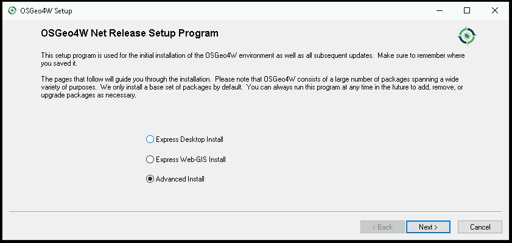
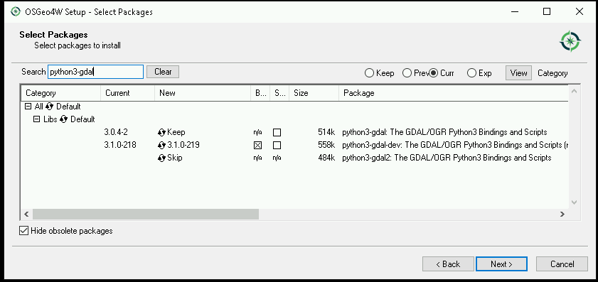
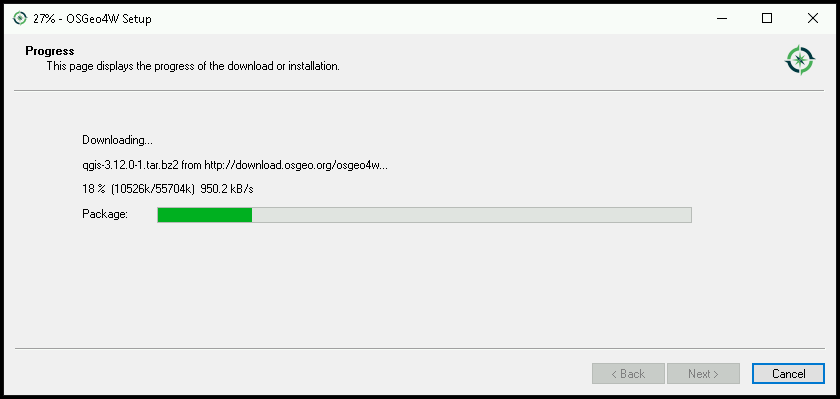
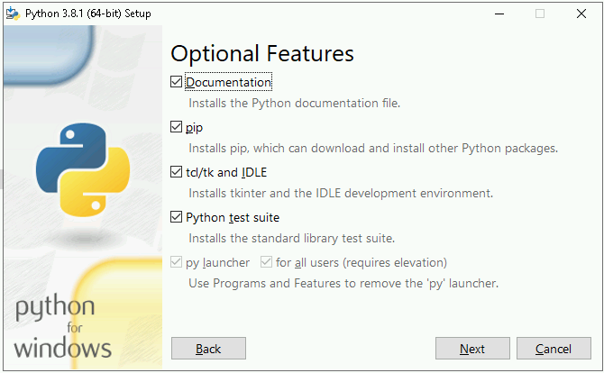
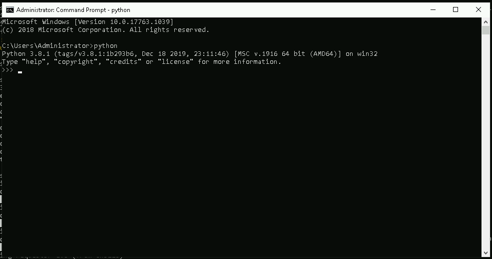

Instalace na operační systému MS Windows
========================================

.. note:: Kurzy GISMentors probíhají na operačním systému Linux a máme pro to
        řadu dobrých důvodů: větší provázanost knihoven, stabilita, možnost
        snáze něco "opravit". Platforma MS Windows pro nás není domácí a pro
        vývoj programů pro práci s prostorovými daty není vhodná, pro svou
        roztříštěnost a nestabilitu - tedy pokud se nespojíte pouze s nástroji
        dostupnými od velkého producenta proprietárních GIS programů. Nicméně
        věříme, se nám podařilo popsat, jak nastavit celkem použitelné prostředí pro
        zpracování prostorových dat v jazyce Python na platformě Windows.

Na platformě Windows máme (minimálně) dvě prostředí, v jakých můžeme Python
provozovat:

* Z distribuce `OSGeo4W <https://trac.osgeo.org/osgeo4w/>`_ - což je sada
  programů s otevřeným zdrojovým kódem  pro prostředí Windows. Všechny programy
  z této distribuce spolu navzájem "mluví", bohužel ale OSGeo4W neobsahuje
  všechny knihovny, které v tomto kurzu doporučujeme. Situace se v budoucnu ale
  může změnit.
* Nativní distribuce Pythonu ze stránek `http://python.org
  <http://python.org>`_. Do tohoto prostředí lze doinstalovat všechny knihovny
  používané v tomto kurzu, ale jejich zapojení např. do QGIS nebo GRASS GIS bude
  spíše nemožné.

.. note:: Je "zvykem", že na Windows si všechny programy s sebou instalují
        všechny potřebné knihovny. Takže pokud máte v systému ArcGIS, máte i
        další interní interpret Pythonu zabalený spolu s ArcGISem. Akorát asi
        nebudete vědět "kde v systému je", jaké je verze a integrace s ostatními
        knihovnami bude ještě obtížnější.

Instalace OSGeo4W
-----------------

`OSGeo4W <https://trac.osgeo.org/osgeo4w/>`_  je instalátor pro otevřený
software pro GIS na platformě Windows. Instalace probíhá tak, že stáhneme jeprve
instalátor, který nás po spuštění provede výběrem požadovaných balíků a po
odsouhlasení balíky stáhne a nainstaluje.

.. note:: OSGeo4W nainstaluje na počítač svoji vlastní verzi
          Pythonu. Pokud máte Python již nainstalován, budete mít na
          stroji jeho více verzí vedle sebe. Což je ale ve světě
          Windows běžné, softwary, které Python používají si často
          instalují vlastní verze a nepoužívají systémově
          nainstalovaný Python (pokud existuje). Pokud si
          nainstalujete i další software jako je QGIS či GRASS GIS a
          další, tak minimálně tento software bude v rámci OSGeo4W
          instalace sdílet jednu verzi Pythonu.

Při instalaci zvolte pokročilou volbu - Advanced - a po zvolení zdrojových
serverů a cílového adresáře, se dostanete až k výběru jednotlivých balíčků.
Pomocí vyhledávání můžete najít jednotlivé balíky a poklepáním myší na řádek se
volba z `Skip` změní na číslo verze, kterou lze nainstalovat (někdy je verzí
víc). Určitě najděte a nainstalujte

* gdal
* python3-pip
* python3-shapely
* python3-gdal
* python3-owslib

A samozřejmě můžete i nainstalovat desktopové programy

* QGIS
* GRASS GIS

Po potvrzení se balíčky stáhnou a nainstalují.

        Spuštění instalátoru, volba Advanced

        Výběr balíčků

        Sledování průběhu instalace

.. note:: V tuto chvíli (2020-02) bohužel nejde v použitelné formě instalovat
        balíčky rasterio a fiona, které budeme v tomto kurzu používat. Vazby na
        knihovnu GDAL ale fungují dobře.

Na konci instalace je ještě potřeba spustit skript `p3_env.bat`, který nastaví
proměnné prostředí pro Python 3.

.. code-block:: bash

        c:\> c:\OSGeo4W64\bin\py3_env.bat

.. figure:: ../../images/osgeo4w-4.png

Instalace chybějících knihoven
^^^^^^^^^^^^^^^^^^^^^^^^^^^^^^
Potřebujeme stáhnout a nainstalovat knihovny, které v distribuci OSGeo4W nejsou
a nebo nefungují, zejména balíčky

* rasterio
* Fiona
* shapely

Ze stránek `Unofficial Windows Binaries for Python Extension Packages
<http://www.lfd.uci.edu/%7Egohlke/pythonlibs/>`__ stáhneme pro knihovny
GDAL, Fiona, Shapely, Rasterio a OWSLib soubory ve formátu Wheel - je důležité,
aby verze Pythonu, pro kterou byly balíky připraveny, byla stejná, jako verze
Pythonu v OSGeo4W. Proto spustíme OSGeo4W Shell a zjistíme verzi::

        c:\> python3 --version

        Python 3.7.0

Stáhneme tedy soubory

* rasterio‑1.1.2‑cp37‑cp37m‑win_amd64.whl
* Fiona‑1.8.13‑cp37‑cp37m‑win_amd64.whl
* Shapely‑1.7.0‑cp37‑cp37m‑win_amd64.whl

A doinstalujeme tyto balíky pomocí `pip` v prostředí OSGeo4W shell

.. code-block:: bash

        c:\> cd c:\Users\Administrator\Downloads

        c:\Users\Administrator\Downloads> pip install Fiona-1.8.13-cp37-cp37m-win_amd64.whl
        c:\Users\Administrator\Downloads> pip install rasterio-1.1.2-cp37-cp37m-win_amd64.whl
        c:\Users\Administrator\Downloads> pip install Shapely-1.7.0-cp37-cp37m-win_amd64.whl

Následně můžeme instalaci vyzkoušet

.. code-block:: bash

        c:\Users\Administrator\Downloads>python3

        Python 3.7.0 (v3.7.0:1bf9cc5093, Jun 27 2018, 04:59:51) [MSC v.1914 64 bit (AMD64)] on win32
        Type "help", "copyright", "credits" or "license" for more information.

        >>> import shapely
        >>> import fiona
        >>> import rasterio
        >>>

A otestovat, jak se daří načíst prostorová data (po stažení dat z úvodu tohoto
kurzu)

.. code-block:: bash

        >>> chko = fiona.open("data/chko.shp")
        >>> chko.driver
        'ESRI Shapefile'

        >>> lsat = rasterio.open("data/lsat7_2002_nir.tiff")
        >>> lsat.driver
        'GTiff'

.. _win-py-bin:

Instalace nativního interpretu CPython
--------------------------------------

.. note:: Pokud budete používat pouze nativní interpretr CPythonu, mimo
        prostředí OSGeo4W, nebudete moci kombinovat knihovny s QGIS, GRASS a
        dalšími.

Ze stránek https://www.python.org/downloads/windows/ stáhněte aktuální verzi jazyka Python s označením
3 - použijte 64bit verzi - tedy `Windows x86-64 executable installer <https://www.python.org/ftp/python/3.8.1/python-3.8.1-amd64.exe>`_

.. note:: Odkazy výše odkazjí přímo na verzi interpretu 3.8.1! Ujistěte se, že
        stahujete aktuální verzi intepretu.

Spusťte instalátor - v Administrátorském režimu - a nastavte Customize installation. Zaškrtněte přidání
Python do proměnné :var:`PATH`.

.. figure:: ../../images/install-windows-cpython-1.png

        Spuštění instalátoru, volba Custom

Na další obrazovce zvolte určitě instalaci `pip` a ujistěte se, že budete
instalovat Python pro "všechny uživatele". Python se tak nainstaluje do
kořenového adresáře na disk `C:\Program files\Python3` a ne pouze kamsi do uživatelských
složek.

        Další volby

V dalším kroku se ujistěte, že instalujete "pro všechny uživatele", cesta vede
do adresáře `Program Files`, asociujte soubory s koncovkou `.py` jako soubory
interpretované Pythonem.

.. figure:: ../../images/install-windows-cpython-3.png

        Sledování průběhu instalace

Průběh instalace a hotovo.

.. figure:: ../../images/install-windows-cpython-4.png

        Sledování průběhu instalace

Po instalaci a spuštění příkazové řádky (`cmd`) můžete Python spustit:

        Sledování průběhu instalace

V dalším kroce je potřeba do prostředí doinstalovat námi požadované knihovny. 

Ze stránek `Unofficial Windows Binaries for Python Extension Packages
<http://www.lfd.uci.edu/%7Egohlke/pythonlibs/>`__ stáhneme pro knihovny
GDAL, Fiona, Shapely, Rasterio a OWSLib soubory ve formátu Wheel (vždy
pro danou verzi Pythonu (v tomto dokumentu používáme 3.8) a platformu (amd64)).

Poté otevřeme příkazovou řádku Windows a doinstalujeme požadované
knihovny, například:

.. code-block:: bash

   pip install Downloads\Shapely-1.7.0-cp38-cp38-win32.whl
   pip install Downloads\Fiona-1.8.13-cp38-cp38-win32.whl
   ...

Instalace rasterio
^^^^^^^^^^^^^^^^^^
Před vlastní instalací knihovny Rasterio do prostředí CPython na Windows musíme
instalovat ručně balík `Numpy
<https://www.lfd.uci.edu/~gohlke/pythonlibs/#numpy>`_ a Microsoft Visual Studio
2015 a mladší, nelépe ke stažení z

* `http://go.microsoft.com/fwlink/?LinkId=691126&fixForIE=.exe. <http://go.microsoft.com/fwlink/?LinkId=691126&fixForIE=.exe.>`_

.. code-block:: bash

   pip install Downloads\numpy‑1.18.1+mkl‑cp38‑cp38‑win_amd64.whl

Potom už můžeme instalovat rasterio

.. code-block:: bash

   pip install Downloads\rasterio‑1.1.2‑cp38‑cp38‑win_amd64.whl

A následně můžeme instalaci vyzkoušet:

.. code-block:: bash

        c:\Users\Administrator\Downloads>python3

        Python 3.7.0 (v3.7.0:1bf9cc5093, Jun 27 2018, 04:59:51) [MSC v.1914 64 bit (AMD64)] on win32
        Type "help", "copyright", "credits" or "license" for more information.

        >>> import shapely
        >>> import fiona
        >>> import rasterio
        >>>

A otestovat, jak se daří načíst prostorová data (po stažení dat z úvodu tohoto
kurzu)

.. code-block:: bash

        >>> chko = fiona.open("data/chko.shp")
        >>> chko.driver
        'ESRI Shapefile'

        >>> lsat = rasterio.open("data/lsat7_2002_nir.tiff")
        >>> lsat.driver
        'GTiff'

