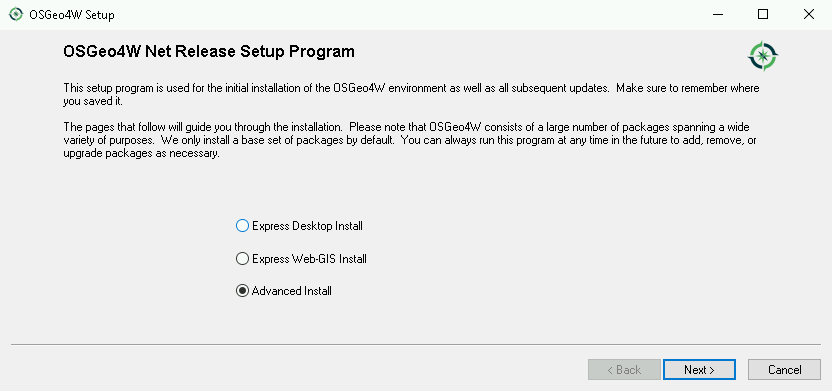
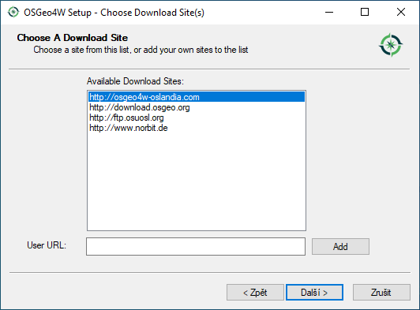
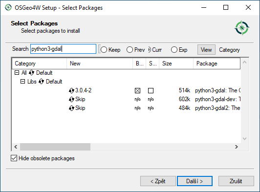
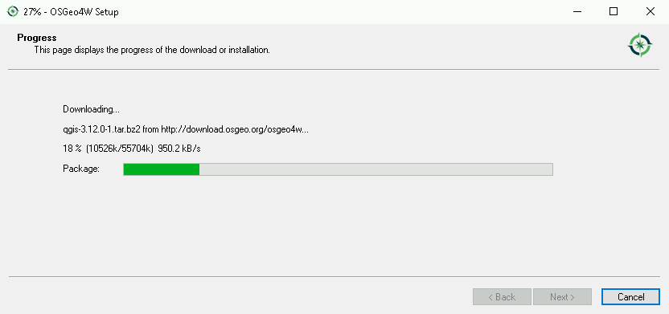
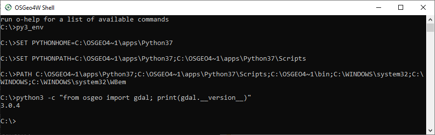
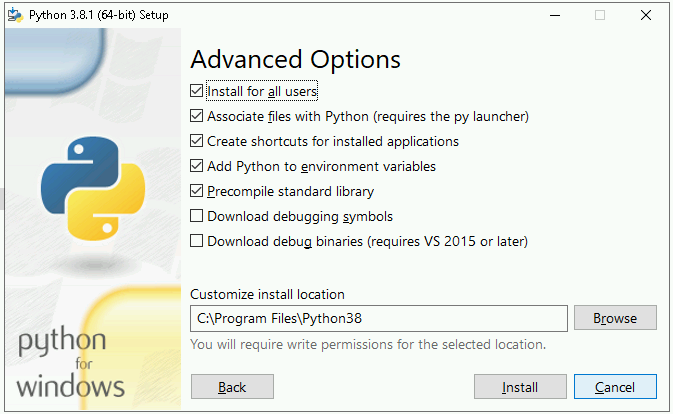
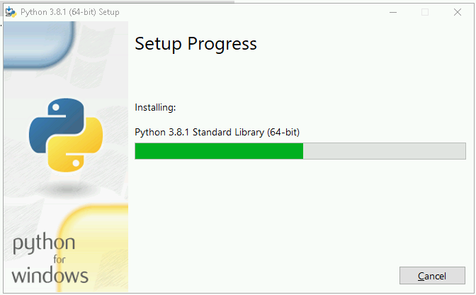
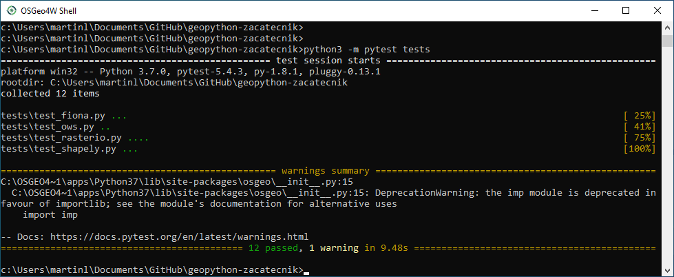

Instalace na operační systému MS Windows
========================================

Tato kapitola by vám měla pomoci nastavit použitelné prostředí pro
zpracování prostorových dat pomocí open source knihoven v jazyce
Python na operačním systému MS Windows.
        
.. note:: Kurzy GISMentors probíhají na operačním systému Linux a máme
        pro to řadu dobrých důvodů: lepší provázanost knihoven,
        stabilita, možnost snáze něco "opravit". Platforma MS Windows
        pro nás není domácí. Navíc není pro vývoj programů pro práci s
        prostorovými daty s využitím open source knihoven úplně
        ideální, především pro svou roztříštěnost a nestabilitu.

Na operačním systému MS Windows máme (minimálně) **dvě
prostředí/možnosti**, v jakých můžeme Python provozovat:

* Z distribuce `OSGeo4W <https://trac.osgeo.org/osgeo4w/>`_ - což je
  sada programů s otevřeným zdrojovým kódem pro operační systém MS
  Windows. Všechny programy z této distribuce spolu navzájem "mluví",
  bohužel ale OSGeo4W neobsahuje (nebo nejsou aktuální) všechny
  knihovny, které v tomto kurzu doporučujeme. Situace se v budoucnu
  ale může změnit.
* Nativní distribuce Pythonu ze stránek `http://python.org
  <http://python.org>`_. Do tohoto prostředí lze doinstalovat všechny knihovny
  používané v tomto kurzu, ale jejich zapojení např. do QGIS nebo GRASS GIS bude
  velmi obtížné až nemožné.

.. note:: Je "zvykem", že na MS Windows si všechny programy s sebou
        instalují všechny potřebné knihovny. Takže pokud máte v
        systému Esri ArcGIS, máte i další interní interpret Pythonu
        zabalený spolu s ArcGISem. Většinou ale nebudete vědět "kde v
        systému je" a jaké verze. Navíc integrace s ostatními (open
        source) knihovnami bude ještě obtížnější.

Instalace OSGeo4W
-----------------

`OSGeo4W <https://trac.osgeo.org/osgeo4w/>`_ je síťový instalátor pro
otevřený GIS software pro operační systém MS Windows. Instalace
probíhá tak, že stáhneme neprve instalátor (typicky 64bit
`osgeo4w-setup-x86_64.exe
<http://download.osgeo.org/osgeo4w/osgeo4w-setup-x86_64.exe>`__),
který nás po spuštění provede výběrem požadovaných balíčků a po
odsouhlasení je sám stáhne a nainstaluje.

.. note:: OSGeo4W nainstaluje na počítač svoji vlastní verzi
          Pythonu. Pokud máte Python již nainstalován, budete mít na
          stroji jeho více verzí vedle sebe. Což je ale ve světě
          Windows běžné. Softwary, které Python používají, si často
          instalují vlastní verze a nepoužívají systémově
          nainstalovaný Python (pokud existuje). Pokud si
          nainstalujete i další software jako je QGIS či GRASS GIS a
          další, tak minimálně tento software bude v rámci OSGeo4W
          instalace sdílet jednu společnou verzi Pythonu.

Při instalaci vyberte pokročilou volbu - *Advanced Install* - po
zvolení zdrojových serverů a cílového adresáře, se dostanete až k
výběru jednotlivých balíčků.

           
   Spuštění OSGeo4W instalátoru, volba Advanced Install

Před volbou softwarových balíčků k instalaci ještě zvolte server, ze
kterého se budou balíčky stahovány. Kromě oficiálního
http://download.osgeo.org jsou dispozici i další servery, které mohou
mít rychlejší odezvu. 

           
   Volba serveru pro stahování instalačních balíčků.

Další nastavení nechme ve výchozím stavu. V sekci **Select Packages**
pomocí vyhledávání můžete jednotlivé balíčky najít a poklepáním myší
na řádek se volba ze `Skip` změní na číslo verze, kterou lze
nainstalovat (někdy je dostupných verzí víc).

Po potvrzení se balíčky stáhnou a nainstalují.

   Výběr softwarových balíčků, v tomto případě ``python3-gdal``.

V našem případě najděte a nainstalujte následující balíčky:

* ``python3-pip``
* ``python3-gdal``
* ``python3-owslib``

.. _instalace-osgeo4w-cmd:

.. tip:: Nainstalovat celé prostředí lze jednoduše **v jednom kroku**
   přímo z příkazové řádky MS Windows. Otevřte příkazový řádek Windows
   jako *admistrátor*, přepněte se do adresáře (příkaz ``cd``), kam jste
   stáhli instálator OSGeo4W a spusťte následující příkaz.

   .. code-block:: bash
                   
      osgeo4w-setup-x86_64.exe -g -k -a x86_64 -R C:\OSGeo4W64 -s http://osgeo4w-oslandia.com/osgeo4w -q ^
      -P python3-pip,python3-gdal,python3-owslib,qgis-ltr-full
   
.. note:: A samozřejmě můžete i nainstalovat desktopový program QGIS
   (není podmínkou pro toto školení).

   * ``qgis-full`` (nebo ``qgis-ltr-full`` pro LTR verzi)

        Sledování průběhu instalace

Pro otestování prostředí otevřeme *OSGeo4W Shell*. Před vstupem do
interpreta jazyka Python, musíme spustit skript :file:`p3_env`, který
nastaví proměnné prostředí pro Python 3.

.. code-block:: cmd

   py3_env
   python3 -c "from osgeo import gdal; print(gdal.__version__)"
        

.. important:: V tuto chvíli (jaro 2020) bohužel nejde v použitelné
   formě instalovat balíčky ``rasterio`` (chybí) a ``fiona/shapely``
   (nefunkční), které budeme v tomto kurzu používat. Vazby na knihovnu
   GDAL ale fungují dobře, postup je popsán v kapitole
   :ref:`osgeo4w-fiona-etc`.

.. _osgeo4w-fiona-etc:

Instalace chybějících knihoven
^^^^^^^^^^^^^^^^^^^^^^^^^^^^^^

Potřebujeme stáhnout a nainstalovat knihovny, které v distribuci OSGeo4W nejsou
a nebo nefungují, zejména balíčky

* `Rasterio <https://www.lfd.uci.edu/~gohlke/pythonlibs/#rasterio>`__
* `Fiona <https://www.lfd.uci.edu/~gohlke/pythonlibs/#fiona>`__
* `Shapely <https://www.lfd.uci.edu/~gohlke/pythonlibs/#shapely>`__

Ze stránek `Unofficial Windows Binaries for Python Extension Packages
<http://www.lfd.uci.edu/%7Egohlke/pythonlibs/>`__ stáhneme pro
knihovny Fiona, Shapely a Rasterio soubory ve formátu Wheel - je
důležité, aby verze Pythonu, pro kterou byly balíky připraveny, byla
stejná jako verze Pythonu v OSGeo4W. Proto spustíme *OSGeo4W Shell* a
zjistíme verzi::

        C:\> python3 --version

        Python 3.7.0

V našem případě tedy stáhneme např. soubory

* :file:`rasterio‑1.1.4‑cp37‑cp37m‑win_amd64.whl`
* :file:`Fiona‑1.8.13‑cp37‑cp37m‑win_amd64.whl`
* :file:`Shapely‑1.7.0‑cp37‑cp37m‑win_amd64.whl`

A doinstalujeme tyto balíky pomocí :program:`pip` v prostředí
*OSGeo4W Shell* jako *správce*. Nezapomeňte nejprve nastavit
prostředí pro Python 3 spuštěním skriptu :file:`py3_env`.

.. code-block:: bash

   py3_env
       
   cd C:\Users\Administrator\Downloads

   python3 -m pip install Fiona-1.8.13-cp37-cp37m-win_amd64.whl
   python3 -m pip install rasterio-1.1.4-cp37-cp37m-win_amd64.whl
   python3 -m pip install Shapely-1.7.0-cp37-cp37m-win_amd64.whl

Následně můžeme instalaci vyzkoušet :ref:`install-pytest`.

.. _win-py-bin:

Instalace nativního interpretu CPython
--------------------------------------

.. important:: Pokud budete používat pouze nativní interpret CPython
   (mimo prostředí OSGeo4W), nebudete moci (nebo velmi obtížně)
   kombinovat knihovny s QGIS, GRASS GIS a dalšími.

Ze stránek https://www.python.org/downloads/windows/ stáhněte aktuální
verzi jazyka Python s označením 3.x - použijte 64bit verzi - tedy
např. `Windows x86-64 executable installer
<https://www.python.org/ftp/python/3.8.1/python-3.8.1-amd64.exe>`__.

.. note:: Odkazy výše ukazují přímo na verzi interpretu 3.8.1!
   Ujistěte se, že stahujete aktuální verzi intepretu.

Spusťte instalátor - v administrátorském režimu - a nastavte *Customize
installation*. Zaškrtněte přidání Python do proměnné :envvar:`PATH`.

.. figure:: ../images/install-windows-cpython-1.png

        Spuštění instalátoru, volba Customize installation

Na další obrazovce zvolte určitě instalaci :program:`pip`.

.. figure:: ../images/install-windows-cpython-2.png

        Další volby

V dalším kroku se ujistěte, že budete instalovat Python pro "všechny
uživatele" (*Install for all users*). Python se tak nainstaluje do
kořenového adresáře na disk :file:`C:\\\Program Files\\Python38` a ne
pouze kamsi do uživatelských složek.

        Sledování průběhu instalace

Průběh instalace a hotovo.

        Sledování průběhu instalace

Po instalaci a spuštění příkazové řádky (`cmd`) můžete Python sputit přímo.

V dalším kroce je potřeba do prostředí doinstalovat námi požadované
knihovny.

Ze stránek `Unofficial Windows Binaries for Python Extension Packages
<http://www.lfd.uci.edu/%7Egohlke/pythonlibs/>`__ stáhneme knihovny
GDAL, Fiona, Shapely, Rasterio a OWSLib soubory ve formátu Wheel. Vždy
pro danou verzi Pythonu (v tomto dokumentu používáme 3.8) a 64bit
platformu (amd64).

Poté otevřeme příkazovou řádku Windows jako *správce* a
doinstalujeme požadované knihovny, například:

.. code-block:: cmd

   pip install Downloads\Shapely-1.7.0-cp38-cp38-win32.whl
   pip install Downloads\Fiona-1.8.13-cp38-cp38-win32.whl
   ...

Instalace Rasterio
^^^^^^^^^^^^^^^^^^

Před vlastní instalací knihovny Rasterio do prostředí CPython na
Windows musíme instalovat ručně balík `Numpy
<https://www.lfd.uci.edu/~gohlke/pythonlibs/#numpy>`_ a Microsoft
Visual Studio 2015 a mladší, nejlépe ke stažení z
`http://go.microsoft.com/fwlink/?LinkId=691126&fixForIE=.exe. <http://go.microsoft.com/fwlink/?LinkId=691126&fixForIE=.exe.>`_

.. code-block:: cmd

   pip install Downloads\numpy‑1.18.1+mkl‑cp38‑cp38‑win_amd64.whl

Potom už můžeme instalovat rasterio

.. code-block:: cmd

   pip install Downloads\rasterio‑1.1.2‑cp38‑cp38‑win_amd64.whl

Následně můžeme instalaci vyzkoušet :ref:`install-pytest`.
   
.. _install-pytest:

Otestování instalace
--------------------

Otevřte *OSGeo4W Shell* (anebo příkazový řádek Windows v případě
nativního interpretu CPython) jako *správce* a doinstalujte
:program:`pytest` (v případě *OSGeo4W Shell* ještě nastavíme prostředí
pro Python 3 pomocí ``py3_env``).

.. code-block:: cmd

   py3_env
   python3 -m pip install pytest

Stáhněte repositář *geopython-zacatecnik* pomocí :program:`git` anebo
přímo jako `zip soubor
<https://github.com/GISMentors/geopython-zacatecnik/archive/master.zip>`__
a rozbalte.

Otevřte *OSGeo4W Shell* (anebo příkazový řádek Windows v případě
nativního interpretu CPython) jako běžný uživatel a vstupte do
rozbalené složky, např.:

.. code-block:: cmd

   cd C:\Users\user\Downloads\geopython-zacatecnik-master\geopython-zacatecnik-master

.. note:: Nejedná se překlep. Zip obsahuje složku
   :file:`geopython-zacatecnik-master`, což se pod Windows projeví
   vnořením do složky :file:`geopython-zacatecnik-master`
   (odpovídající názvu zip souboru). Následující příkaz je podstatné
   spustit ze složky, která obsahuje podsložku :file:`tests`. To
   můžete ověřit příkazem ``dir``.

Testy spustíte následujícím příkazem (v případě *OSGeo4W Shell* ještě
nastavíme prostředí pro Python 3 pomocí ``py3_env``).

.. code-block:: cmd

   py3_env
   python3 -m pytest tests

   Spuštění testů pod Windows.
