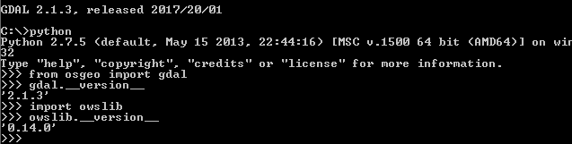

Poznámky k pracovnímu prostředí
===============================

Ubuntu/Debian
-------------

Instalace knihoven z výchozích repozitářů by měla v běžné situaci
stačit.

.. code-block:: bash

   sudo apt-get install fiona python-fiona rasterio python-rasterio python-owslib python-pyproj

.. tip:: Pokud potřebuje novější verze knihoven, tak před instalací
   zaregistrujte ještě UbuntuGIS repozitář.

   .. code-block:: bash

      sudo add-apt-repository ppa:ubuntugis/ubuntugis-unstable
      sudo apt-get update

MS Windows
----------

Nejsnažší cesta v MS Windows, jak nainstalovat Python a související
GIS knihovny jako např. GDAL, je použít metainstalátor `OSGeo4W
<https://trac.osgeo.org/osgeo4w>`__.

.. warning:: Framework OSGeo4W v současnosti bohužel neobsahuje
             knihovny Fiona, Shapely a RasterIO (viz hlášení `#439
             <https://trac.osgeo.org/osgeo4w/ticket/439>`__ a `#438
             <https://trac.osgeo.org/osgeo4w/ticket/438>`__). Pokud
             tyto knihovny bude využívat, doporučujeme alternativní
             postup, viz kapitola :ref:`win-py-bin`.

OSGeo4W (GDAL, OWSLib)
^^^^^^^^^^^^^^^^^^^^^^

Nejprve si na stáhneme instalátor OSGeo4W (`32bit
<http://download.osgeo.org/osgeo4w/osgeo4w-setup-x86.exe>`__ nebo
`64bit <http://download.osgeo.org/osgeo4w/osgeo4w-setup-x86_64.exe>`__
verzi) a spustíme.

.. note:: OSGeo4W nainstaluje na počítač svoji vlastní verzi
          Pythonu. Pokud máte Python již nainstalován, budete mít na
          stroji jeho více verzí vedle sebe. Což je ale ve světě
          Windows běžné, softwary, které Python používají si často
          instalují vlastní verze a nepoužívají systémově
          nainstalovaný Python (pokud existuje). Pokud si
          nainstalujete i další software jako je QGIS či GRASS GIS a
          další, tak minimálně tento softwarě bude v rámci OSGeo4W
          instalace sdílet jednu verzi Pythonu.

.. figure:: images/osgeo4w-0.png

   Zvolíme metodu "Advanced Install".

.. figure:: images/osgeo4w-1.png

   Určíme adresář, kam se OSGeo4W nainstaluje.

V dalším kroku zvolíme požadované balíčky buď pro Python 2:

* gdal-python
* owslib

anebo Python 3:

* python3-gdal
* python3-owslib
    
.. figure:: images/osgeo4w-2.png

   Vybereme balíčky požadované balíčky.

.. figure:: images/osgeo4w-3.png

   Instalátor OSGeo4W stáhne a nainstaluje všechny potřebné závislosti.

Instalaci knihoven GDAL a OWSLib otestujeme z *OSGeo4W Shell*:
 

.. important:: Při spouštění Vašich skriptů v jazyku Python z
   příkazové řádky anebo v rámci Vašeho oblíbeného editoru je vždy nutné
   zajistit, aby byl použit Python z instalace OSGeo4W a ne jiná verze
   Pythonu typicky nainstalovaná jako systémová verze. Nejsnažší cestou
   je spouštět skripty přímo z *OSGeo4W Shell*, kde je vše již nastaveno.

.. _win-py-bin:

Binární balíčky (GDAL, Fiona, Shapely, Rasterio, OWSlib)
^^^^^^^^^^^^^^^^^^^^^^^^^^^^^^^^^^^^^^^^^^^^^^^^^^^^^^^^               

Pro instalaci knihovnen použijeme binarní balíčky ze stránek:
http://www.lfd.uci.edu/%7Egohlke/pythonlibs/

Nejprve nainstalujeme požadovanou verzi Pythonu (výběr je omezen
podporovanými verzemi zdroje uvedeného výše). V našem případě zvolíme
např. Python 3.6 ze stránek https://www.python.org/downloads/.

Ze stránek `Unofficial Windows Binaries for Python Extension Packages
<http://www.lfd.uci.edu/%7Egohlke/pythonlibs/>`__ stáhneme pro knihovny
GDAL, Fiona, Shapely, Rasterio a OWSlib soubory ve formátu Wheel (vždy
pro danou verzi Pythonu a platformu).

Poté otevřeme příkazovou řádku Pythonu a doinstalujeme požadované
knihovny:

.. code-block:: bash

   pip install /cesta/k/souboru/gdal.whl
   pip install /cesta/k/souboru/fiona.whl
   ...
