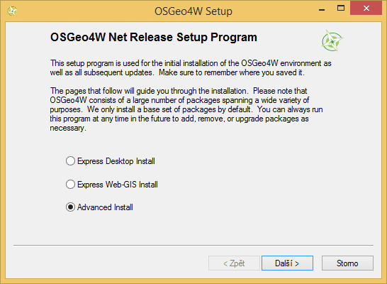
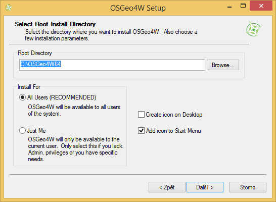
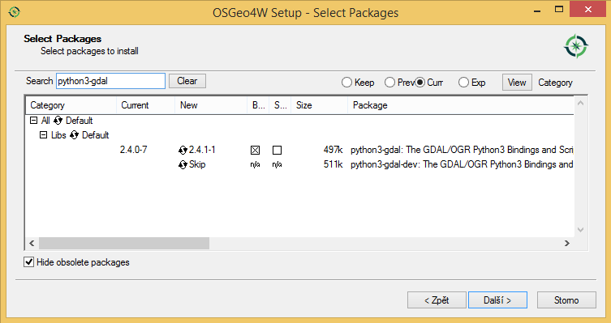
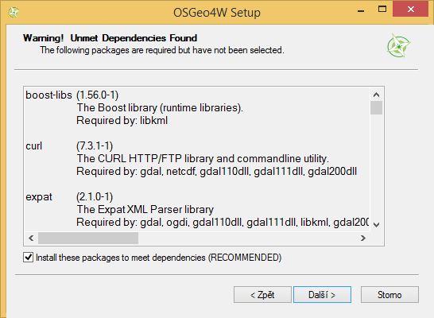

Poznámky k pracovnímu prostředí
===============================

Ubuntu/Debian
-------------

Instalace knihoven z výchozích repozitářů by měla v běžné situaci
stačit.

.. code-block:: bash

   sudo apt-get install fiona python-fiona rasterio python-rasterio python-owslib python-pyproj

.. tip:: Pokud potřebuje novější verze knihoven, tak před instalací
   zaregistrujte ještě UbuntuGIS repozitář.

   .. code-block:: bash

      sudo add-apt-repository ppa:ubuntugis/ubuntugis-unstable
      sudo apt-get update

MS Windows
----------

Nejsnažší cesta, jak nainstalovat všechny potřebné knihovny, je použít
metainstalátor `OSGeo4W <https://trac.osgeo.org/osgeo4w>`__.

.. note:: Tento postup má také svoje nevýhody. OSGeo4W nainstaluje na
          počítač svoji vlastní verzi Pythonu. Pokud tedy již máte
          vlastní Python nainstalován, budete mít na stroji více verzí
          Pythonu. Což je ale ve světě Windows běžné, softwary, které
          Python používají si často instalují vlastní verze a
          nepoužívají systémově nainstalovaný Python (pokud
          existuje). Pokud si přes OSGeo4W nainstalujete další
          software jako je QGIS či GRASS GIS, tak minimálně tyto
          softwary budou v rámci OSGeo4W instalace sdílet jednu verzi
          Pythonu.

Nejprve si na stáhneme instalátor OSGeo4W (`32bit
<http://download.osgeo.org/osgeo4w/osgeo4w-setup-x86.exe>`__ nebo
`64bit <http://download.osgeo.org/osgeo4w/osgeo4w-setup-x86_64.exe>`__
verzi) a spustíme.

   Zvolíme metodu "Advanced Install".

   Určíme adresář, kam se OSGeo4W nainstaluje.

   Vybereme balíčky ``gdal-python``, ``python-pip`` a ``owslib``.

   Instalátor OSGeo4W stáhne a nainstaluje všechny potřebné závislosti.

Po úspěšné instalaci spustíme (nutné jako administrátor) příkazovou
řádku ``OSGeo4W Shell`` a doinstalujeme zbývající knihovny přes
standardní Python instalátor ``pip``.

.. code-block:: bash

   pip install setuptools
   pip install fiona
   pip install rasterio
   pip install pyproj

.. important:: Tento postup nicméně vyžaduje, aby byl na počítači nainstalován
   kompilátor Microsoft Visual C++! Alternativou je použít neoficiální
   binární balíčky: http://www.lfd.uci.edu/~gohlke/pythonlibs/

   .. code-block:: bash

      pip install cesta/k/wkl/souboru
   
.. important:: Při spouštění uživatelských Python skriptů z příkazové
               řádky anebo v rámci Vašeho oblíbeného editoru je vždy
               nutné zajistit, aby byl použit Python z instalace
               OSGeo4W a ne jiná verze Pythonu typicky nainstalovaná
               jako systémová verze. Nejsnažší cestou je spouštět
               skripty přímo z OSGeo4W Shell, kde je vše již
               nastaveno.
