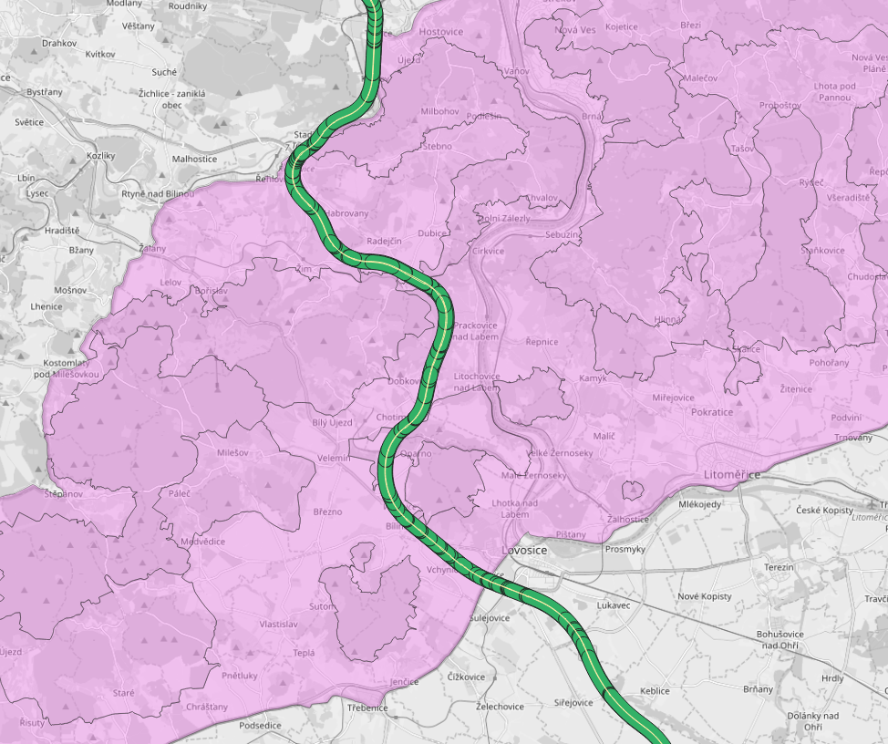
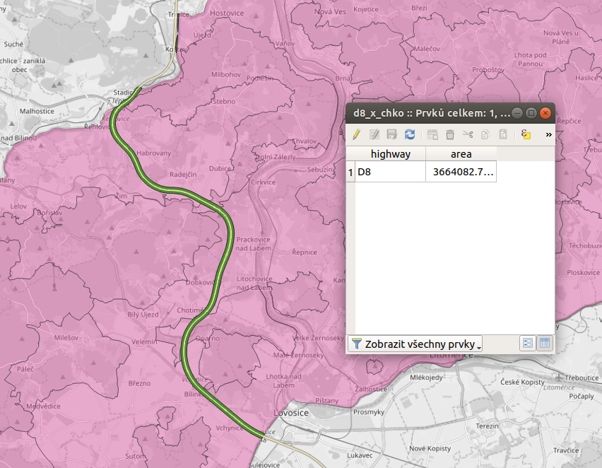

Dálnice přes České středohoří
-----------------------------
.. task:: Nová dálnice přes CHKO České středohoří

        Najděte oblasti, kterých se bezprostředně dotkla výstavba dálnice D8 z
        Prahy do Drážďan. Předpokládejme, že se jedná o oblast 200m od dálnice.
        O jak velké území se jedná?

.. figure:: ../../images/highways_areas.png

        Dálniční síť České republiky spolu s mapou chráněných krajinných
        oblastí.

Potřebné kroky pro vyřešení úlohy

#. Otevření obou datových zdrojů (:file:`highways.geojson` a :file:`chko.shp`)
#. Převod na společný souřadnicový systém (první datový zdroj je v :epsg:`4326`, druhý v :epsg:`5514`)
#. Vytvoření obalové zóny okolo dálnic
#. Zjištění průniku všech geometrií

Načtení datových zdrojů
^^^^^^^^^^^^^^^^^^^^^^^

Nejprve oba soubory otevřeme pomocí klasického `fiona.open()`. Použijeme buď
klauzuli `with` nebo nesmíme nakonec zapomenout soubory uzavřít.

.. literalinclude:: ../../_static/skripty/highway-example.py
   :language: python
   :lines: 1-11
   :emphasize-lines: 1-2,9-11

Společný souřadnicový systém
^^^^^^^^^^^^^^^^^^^^^^^^^^^^

Data, jak můžeme ověřit, jsou v různých souřadnicových systémech.

.. task:: Zjistěte, v jakých souřadnicových systémech jsou dálnice a chráněné
        krajinné oblasti.

Pro další práci musíme data převést do společného souřadnicového
systému.

Pro transformaci vektorových prvků (resp. jejich geometrií) můžeme
použít funkci `trasnform_geom()`.

.. code-block:: python

        from fiona.transform import transform_geom

        wgs84 = "epsg:4326"
        jtsk = {"init": "epsg:5514"}

        geom_transformed = transform_geom(wgs84, jtsk, feature["geometry"])

Vytvoření obalové zóny okolo dálnic
^^^^^^^^^^^^^^^^^^^^^^^^^^^^^^^^^^^

Pro každý prvek v dálniční síti, nejprve vyfiltrujeme pouze prvky se jménem
dálnice D8, transformujeme geometrii na S-JTSK a vytvoříme obalovou zónu:

.. literalinclude:: ../../_static/skripty/highway-example.py
   :language: python
   :lines: 1-24
   :emphasize-lines: 12-24

        Obalová zóna 200m okolo dálnice

.. note:: Zrychlení topologických operací

        Modul `shapely.speedups` obsahuje zrychlení některých operací optimalizovaných v
        jazyce C. Pokud během instalace byla dostupná knihovan GEOS a pokud byl dostupný
        kompilátor jazyka C, jsou tyto optimalizace automaticky zavedeny.

        Ověřit jejich přítomnost, případně je explicitně povolit, můžeme modulem
        `speedups`::

                >>> from shapely import speedups
                >>> print(speedups.available)
                True
                >>> speedups.enable()

Průnik geometrií
^^^^^^^^^^^^^^^^

Pro každou chráněnou krajinnou oblast musíme nejprve zjistit, jestli se
geometrie CHKO a obalové zóny okolo dálnice protínají - teprve potom má smysl
pokračovat s interkací.

.. literalinclude:: ../../_static/skripty/highway-example.py
   :language: python
   :lines: 1-35
   :emphasize-lines: 24-35

Spojení do jedné geometrie
^^^^^^^^^^^^^^^^^^^^^^^^^^

V tuto chvíli máme data rozkouskovaná, bylo by ale vhodné je spojit do jednoho
geometrického objektu.

.. task:: Spojení geometrií do jednoho objektu

        Navrhněte postup, jak spojit více geometrií do jedné.

Zápis do souboru - OGC GeoPackage
^^^^^^^^^^^^^^^^^^^^^^^^^^^^^^^^^

Pokud potřebujeme uložit některý z binárních typů vektorových souborů (ESRI
Shapefile, OGC GeoPackage, ...) musíme nejprve nadefinovat datové schéma -
atributy a typ geometrií.

.. code-block:: python
        
        schema = {
                'properties': {
                        'highway': 'str'
                },
                'geometry': 'MultiPolygon'
        }

Následně můžeme otevřít nový soubor pro zápis a uložit do něj námi vytvořenou
geometrii.

.. code-block:: python

        with fiona.open("chko_x_highway.gpkg", "w", driver="GPKG", crs="EPSG:5514", schema=schema) as out:
                feature = {
                        'type': 'Feature',
                        'properties': {
                                'highway': 'D8'
                        },
                        'geometry': mapping(one_geometry)
                }
                out.write(feature)

Zápis do souboru - GeoJSON
^^^^^^^^^^^^^^^^^^^^^^^^^^

Zapsat soubor ve formátu GeoJSON je od dost jednodušší, protože se
nemusíme spoléhat na (relativně) komplikovanou funkci `fiona.write()`,
ale můžeme data zapsat napřímo pomocí modulu :python3:`json`.

To nám samozřejmě umožňuje nedodržet stritkní schéma atributů, což může a nemusí
být výhoda.

Mějte na paměti, že podle `GeoJSON specifikace
<https://tools.ietf.org/html/rfc7946#section-4>`_ se předpokládá, že
souřadnicovým systémem je :epsg:`WGS84 <4326>`.

.. note:: `Existuje i způsob
           <http://geojson.org/geojson-spec#coordinate-reference-system-objects>`_,
           jak do GeoJSONu uložit geometrie v jiných souřadnicový
           systémech a i když s ním některé softwary počítají, do
           finální specifikace se tento způsob nedostal.

.. task:: Zapište výstup do formátu GeoJSON

        Vytvořte část skriptu, která převede geometrie na WGS84 a zapíše
        výsledek do souboru GeoJSON.

.. tip:: Pro převod použijte funkci `transform_geom()`, povinný "obal"
        seznamu vektorových prvků (`features`) vypadá pro formát
        GeoJSON následovně.

        .. code-block:: python 
        
                {
                    "type": "FeatureCollection",
                    "features": [
                            {
                                "type":"Feature",
                                "properties": {...},
                                "geometry": {...}
                            },
                            {
                                ...
                            },
                                ...

                    ]
                }

Pokud je pro vás úloha příliš komplikovaná, můžete se na `celý skript samozřejmě
podívat <../../_static/skripty/highway-example.py>`_.

Další atributy
^^^^^^^^^^^^^^

Někdy je výhodné pro další práci s vektorovými daty, uložit vlastnosti
geometrie do atributové tabulky, např. rozlohu plochy nebo délku
linie.

.. task:: Uložení dalších atributů

        Upravíte skript tak, aby výstup obsahoval také celkovou zasaženou plochu
        (m2) CHKO?

        Obalová zóna okolo dálnice protínající CHKO České středohoří.

Optimalizace (diskuse)
^^^^^^^^^^^^^^^^^^^^^^

Skript je ve své podstatě celkem neefektivní a stálo by za to popřemýšlet o jeho
optimalizaci, aby proběhl rychleji:

#. Dálniční těleso je reprezentováno dvěmi liniemi, stálo by za zvážení použít
   pouze jednu z nich
#. Buffer by se mohl spojit pomocí `cascaded_union()` do jedné
   geometrie, tím by se měl následný průnik zrychlit
#. ...
