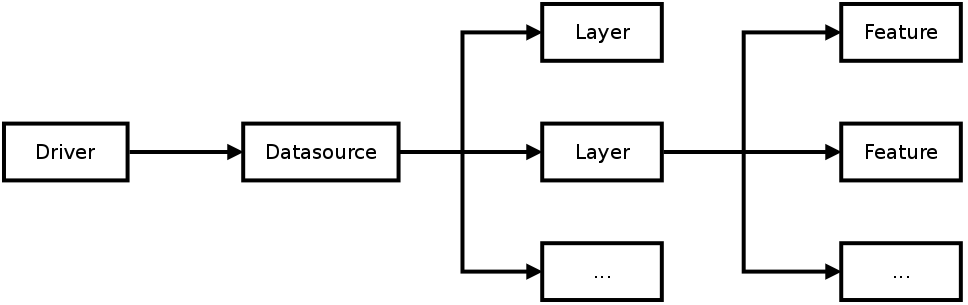

Knihovna OGR (GDAL)
===================

Pro práci s vektorovými daty se v jazyce Python tradičně používá
knihovna `GDAL <http://gdal.org>`_ (resp. její čast označovaná jako
*OGR*).

Knihovna OGR slouží především k převodům mezi vektorovými formáty (ale
i další práci s vektorovými daty, geoprvky včetně geometrie a
atributů). V současné době knihovna podporuje `několik desítek formátů
<http://gdal.org/ogr_formats.html>`_.

.. _ogr-model:

Datový model
------------

Knihovna OGR pracuje s konceptem vrstev (*layers*) uložených v
datových zdrojích (*data source*). OGR používá pro čtení a zápis dat
do podporovaných datových formátů svůj vlastní *abstraktní model*,
který se může jevit jako komplexní, nicméně spolehlivě funguje pro
všechny případy:

* **Driver** - ovladač pro čtení a zápis dat
* **Datasource** - datový zdroj (soubor, databáze, protokol, ...)
* **Layer** - datová vrstva (obsah souboru, databázová tabulka, ...)
* **Feature** - geoprvek
* **Field, Geometry** - atributy, geometrie
    

           
Popis abstraktního modelu pro vektorová data:
http://gdal.org/ogr_arch.html

*Rozhraní pro Python* představuje pouze abstraktní :abbr:`API (rozhraní pro
programování aplikací)` nad původními funkcemi a třídami z jazyka C++,
ve kterém je GDAL naprogramovaný. Také z tohoto důvodu se mohou
některé postupy v jazyku Python jevit jako těžkopádné.

Užitečné odkazy:

* `Dokumentace <http://www.gdal.org/ogr_apitut.html>`__
* `Python API <http://gdal.org/python/>`__
* `Cookbook <https://pcjericks.github.io/py-gdalogr-cookbook/vector_layers.html>`__

Příklady
--------

.. toctree::
   :maxdepth: 2

   buffer
   zapis
   ruian           
